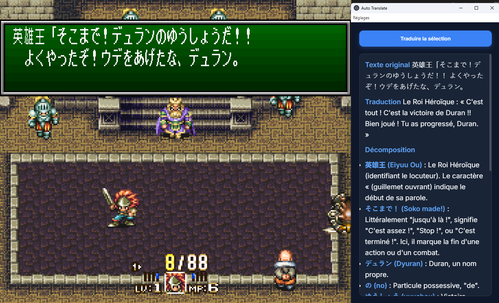

# Auto Translate

Une application Windows permettant de sélectionner une zone de l'écran et de traduire le texte qui s'y trouve à l'aide de l'API Google Gemini. 
Le projet est développé avec Electron, et inclut une authentification Google OAuth.



## Fonctionnalités

- Sélection de zone à l'écran via un overlay transparent
- Capture d'écran de la zone
- Traduction via l'API Google Gemini
- Authentification Google OAuth

## Prérequis

- Node.js
- Clé API Google Cloud

Créez un fichier `.env.local` à la racine pour y stocker vos identifiants (référez-vous au fichier `.env` pour voir le format requis).

## Lancement

```bash
npm install
npm start
```
